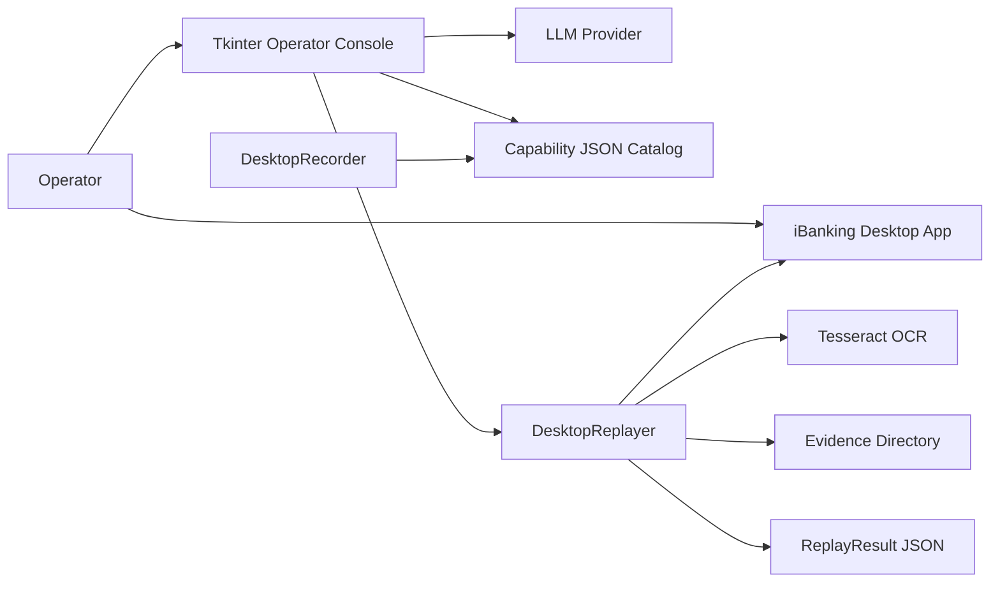

# iBankingAgent Design Document

## 1. Overview

iBankingAgent is a Python computer-use agent arm for operating a live iBanking desktop application without importing, inspecting, or modifying the target application's code. An operator records a workflow at the screen boundary, the system stores it as a versioned capability artifact, and the capability can later be selected from a native chat console and replayed with supplied input values.

The system is intentionally an adapter around a legacy desktop surface. The reusable unit is the capability artifact, not a model-generated plan. The language model selects and parameterizes a previously recorded workflow; it does not directly control the desktop.

## 2. Goals

- Capture real operator workflows as reviewable, versioned JSON artifacts.
- Keep the integration boundary at mouse, keyboard, window, and visible-screen behavior.
- Replay a known workflow deterministically with explicit action and risk policy checks.
- Keep sensitive input values out of persisted capability artifacts.
- Provide a simple native operator console for capability discovery, value collection, confirmation, recording, and results.
- Return structured replay results that can be inspected by tests and downstream tooling.
- Leave room for browser or other native-app adapters without changing the capability schema.

## 3. Non-goals

- Importing or calling iBanking application APIs.
- Inferring arbitrary workflows at runtime.
- Treating screenshots or OCR as a complete application state model.
- Persisting credentials, customer values, or other sensitive inputs by default.
- Replacing human judgment for risky operations or handoff points.
- Providing unattended production banking automation without additional authentication, authorization, audit, and recovery controls.

## 4. System Context



The target application is an external process. The agent interacts with it only through desktop input and visible-window capture. The LLM provider is an external dependency used for intent matching and value extraction.

## 5. Components

### 5.1 Capability model: `agent_arm/artifact.py`

`CapabilityArtifact` is the durable workflow contract. It contains:

- `name`, `goal`, and `target` metadata.
- A version, currently `1.0.0`, and artifact type `desktop.computer_use_capability`.
- Typed parameter metadata, including a `sensitive` flag.
- Declared outputs and a manual final checkpoint.
- Ordered `Step` records.
- A policy with allowlisted actions, blocked actions, risky-action confirmation requirements, and sensitive-value redaction intent.

A `Step` has an ID, action, target strategy, optional value, rationale, risk, and optional checkpoint. Current actions are `click`, `key`, `type`, `wait`, `screenshot`, and the recorder's `handoff` marker.

`ReplayResult` is the execution contract:

```json
{
  "status": "success | blocked | failed",
  "capability": "create_consumer",
  "completed_steps": 19,
  "outputs": {},
  "error": null,
  "evidence": []
}
```

Errors have a stable `code` and human-readable `message`. Evidence contains paths to any screenshots created during execution or failure handling.

### 5.2 Desktop recorder: `agent_arm/recorder.py`

`DesktopRecorder` listens for mouse clicks and macOS keyboard events. It converts them into ordered steps:

- Mouse clicks become coordinate-based `click` steps.
- Character input becomes a `type` step using `{{input:recorded_inputs}}` rather than persisting the typed value.
- Enter, tab, backspace, delete, and space become `key` steps.
- F8 pauses or resumes recording.
- F9 stops recording.
- F10 inserts a `handoff` step and pauses capture.

The recorder writes no target-app data and does not inspect application internals. macOS Accessibility and Input Monitoring permissions are required.

### 5.3 Desktop replayer: `agent_arm/replay.py`

`DesktopReplayer` executes artifact steps through PyAutoGUI. Before each step it:

1. Verifies that the action is allowed by the artifact policy.
2. Blocks non-safe steps unless confirmation was supplied.
3. Resolves step-specific input values, falling back to the shared `recorded_inputs` value for recorded typing.
4. Executes the action against the live desktop.

After each click, and again on replay exit, it searches dialog-sized macOS windows belonging to the recorded target application. This avoids capturing the native chatbot window and allows messages that appear during the operation to be read before the replay ends. Tesseract reads the full popup in memory; standalone `OK`, `Cancel`, and `Close` button labels are removed from the returned text. OCR screenshots are not saved, although failure screenshots may still be saved for runtime diagnostics. The text is returned in `outputs.popup_message`.

### 5.4 Operator console: `agent_arm/desktop.py`

The Tkinter application provides:

- A catalog of JSON capabilities from `artifacts/capabilities/`.
- A chat input for describing the desired operation and providing values.
- A Record dialog that starts, pauses, resumes, and stops a recorder.
- Confirmation before controlling the live desktop.
- Background threads for LLM requests, recording, and replay so the UI remains responsive.
- A persisted latest result at `artifacts/replay-result.json`.

The console maps the LLM's selected capability back to a local catalog entry, accumulates values by recorded input step ID (`type` steps and legacy `key` steps using the input placeholder), reports missing values, and only starts replay when all required inputs have values and the operator confirms.

### 5.5 LLM client: `agent_arm/llm.py`

`LLMClient` supports OpenAI-compatible chat-completion endpoints and Anthropic Messages endpoints. It sends a catalog containing each capability filename, artifact name, goal, and recorded input step IDs. It can map unlabeled values to the selected capability's input sequence, such as the six ordered customer fields.

The required response shape is:

```json
{
  "capability": "create_consumer",
  "values": {"step_004": "..."},
  "missing": ["step_006"],
  "reply": "Please provide the missing value."
}
```

The client uses deterministic generation (`temperature: 0`), validates the response shape, rejects invented values through prompt instructions, and reports malformed or unavailable provider responses as local runtime errors.

## 6. Primary Flows

### 6.1 Record a capability

1. The operator starts the iBanking app and places it in the expected initial state.
2. The operator supplies a capability filename and goal.
3. The recorder captures desktop input events.
4. Sensitive text is represented by input placeholders rather than saved values.
5. The operator may pause capture or insert a human handoff.
6. The operator stops recording.
7. A `CapabilityArtifact` is saved under `artifacts/capabilities/`.

### 6.2 Select and replay a capability

1. The operator describes an operation in the console.
2. The console loads the local capability catalog.
3. The LLM selects one capability and extracts any supplied values.
4. The console maps values to typed step IDs and reports missing values.
5. Once complete, the operator confirms live desktop control.
6. `DesktopReplayer` validates policy and executes the ordered steps.
7. After click actions, the replayer reads target-application popup text with OCR and excludes standalone button labels.
8. The result is shown in chat and saved to `artifacts/replay-result.json`.
9. The console clears the selected capability and input values after displaying the result.

### 6.3 Policy and handoff behavior

Policy is artifact-owned so each capability carries its execution constraints. The default policy allows `click`, `key`, `type`, `wait`, and `screenshot`; blocks `hotkey`, `shell`, and `clipboard_read`; and identifies submit, deposit, delete, and transfer as confirmation-sensitive action classes. A handoff is a recorded pause in automation that requires the operator to operate the target application and press Enter before replay continues.

## 7. Data and Storage

| Location | Contents | Sensitivity |
| --- | --- | --- |
| `artifacts/capabilities/*.json` | Versioned workflow metadata and ordered steps | May contain screen coordinates and workflow structure; must not contain input values |
| `artifacts/evidence/` | Failure or explicitly recorded replay screenshots; OCR popup screenshots are not saved | Potentially sensitive screen content; protect and clean up according to retention policy |
| `artifacts/replay-result.json` | Latest structured result and OCR popup text | May contain customer names or other visible response data |
| Process memory | User input, LLM request/response, OCR screenshots | Sensitive; never log or persist unnecessarily |

The current implementation has no database, encryption layer, artifact signing, audit log, or retention job. Those are required before treating stored artifacts or results as production banking records.

## 8. Reliability and Failure Handling

- Missing Python dependencies produce structured replay failures where possible.
- Missing LLM configuration is reported before a provider request.
- Invalid LLM JSON is rejected rather than interpreted heuristically.
- Disallowed actions fail with `policy_block`.
- Unconfirmed risky steps return `blocked` with `confirmation_required`.
- Desktop exceptions return `failed` with `runtime_error` and an attempted failure screenshot.
- OCR failure is represented as popup text describing the unavailable or unreadable result; OCR is supplemental and must not be treated as proof of transaction success.
- Popup capture is restricted to target-application dialog windows and occurs during replay, rather than only after the final step.
- Coordinate-based actions depend on display layout, scaling, application focus, and target-app state. A replay should therefore be considered valid only when the operator has prepared the expected environment.

## 9. Security and Privacy Model

Trust boundaries are the live desktop, the local Python process, persisted artifacts, and the external LLM provider.

Required controls for a production-grade deployment:

- Never send sensitive values to the LLM unless explicitly required; prefer local parsing or redacted prompts.
- Keep API keys in environment or OS secret storage and never in artifacts or logs.
- Restrict filesystem permissions for capability, evidence, and replay-result directories.
- Add artifact validation and signing before allowing a capability to control a live banking session.
- Require explicit confirmation immediately before every financial or destructive action, not only once per replay.
- Add operator identity, authorization, and immutable audit events.
- Define screenshot and result retention, deletion, and incident-response procedures.
- Treat OCR output as untrusted text and sanitize it before display or downstream use.

## 10. Testing Strategy

Current tests cover artifact round-tripping, version defaults, policy serialization, and the structured failure contract. The next test layers should be:

- Recorder tests for pause/resume, handoff, placeholder generation, and step ordering using mocked input events.
- Replayer tests with a mocked PyAutoGUI boundary for successful actions, skipped repeated input placeholders, policy blocks, risky confirmation, handoff, and runtime screenshot failure.
- LLM client tests for both provider response shapes, fenced JSON, malformed JSON, missing fields, and network errors.
- Console tests for catalog loading, capability matching, missing-value accumulation, confirmation, and result reset.
- A controlled end-to-end smoke test against a disposable iBanking session with a known display geometry.

## 11. Deployment and Operations

1. Create and activate a virtual environment.
2. Install `requirements.txt`.
3. Install the Tesseract executable separately when OCR is needed.
4. Grant macOS Accessibility and Input Monitoring permissions to the Python/terminal process.
5. Launch the target iBanking application and prepare its initial screen.
6. Configure `LLM_BASE_URL`, `LLM_MODEL`, and `LLM_API_KEY` for the console.
7. Run the recorder, replay CLI, or Tkinter console from the repository root.
8. Review capability artifacts before use and inspect `ReplayResult` after each run.

## 12. Evolution Plan

### Near term

- Add schema validation with explicit artifact and policy validation errors.
- Replace raw coordinates where possible with stable target strategies or calibration metadata.
- Add dry-run/preflight mode that checks screen geometry, focus, and capability compatibility without performing mutating actions.
- Add tests around all policy and input substitution branches.
- Make evidence and result paths configurable and add retention guidance.

### Medium term

- Introduce an adapter interface for desktop, browser, and native-app surfaces.
- Add signed capability versions and review status.
- Separate sensitive input collection from LLM intent extraction.
- Add structured audit events and per-step confirmation for risky operations.
- Add recovery checkpoints and operator-visible pause/resume state.

### Long term

- Move from coordinate-only targeting toward accessibility identifiers, semantic controls, or calibrated visual targets.
- Add authenticated execution contexts and least-privilege roles.
- Support isolated test environments and replay simulation.
- Version the artifact schema with migration tooling and compatibility checks.

## 13. Acceptance Criteria

A release is ready for controlled use when:

- A recorded artifact can be loaded and reviewed without the target app's source code.
- The console can select a capability and identify missing input values without starting replay.
- Replay cannot execute an unallowlisted action or an unconfirmed risky step.
- Success, block, and failure outcomes are distinguishable and persisted in the result contract.
- Sensitive values are absent from saved capability JSON and normal logs.
- A known workflow completes in a controlled environment with evidence and operator-visible output.
- The test suite covers artifact serialization, policy gates, input substitution, provider parsing, and replay failure paths.
